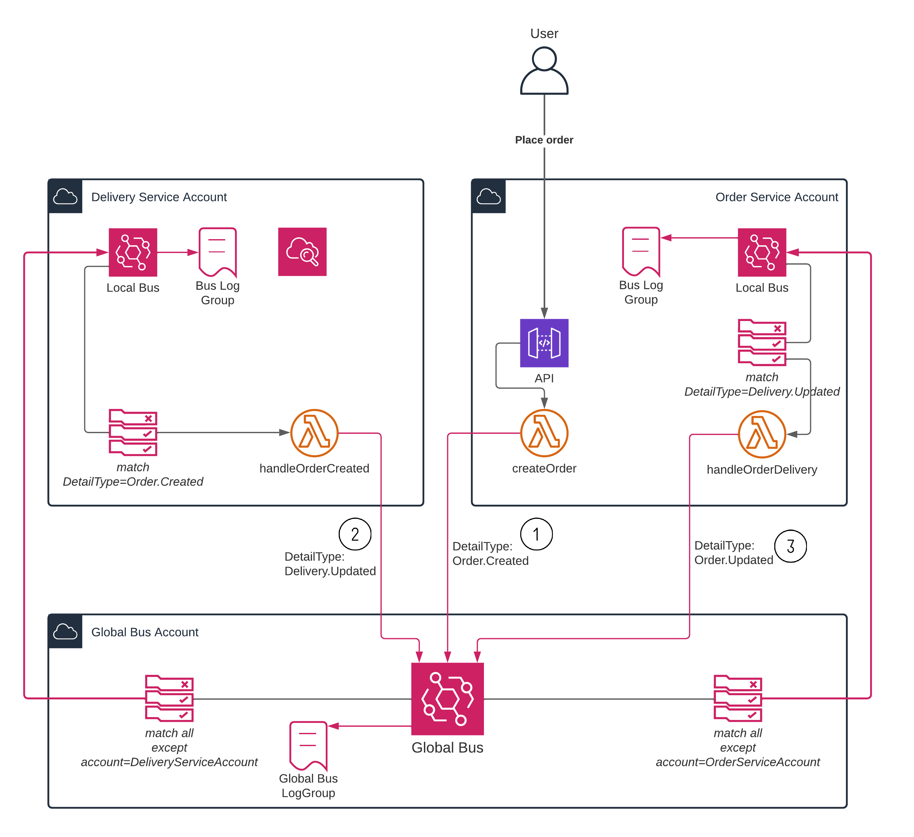
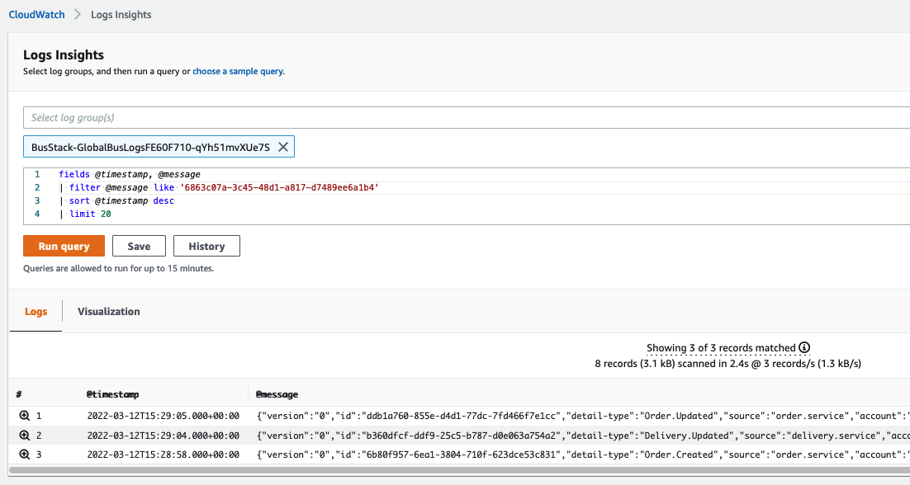

# Cross-account / cross-domain EventBridge backbone example

This is a complete example of using EventBridge in multiple accounts to publish cross-domain application events.

This architecture is detailed in 👉 [this blog post](https://dev.to/eoinsha/how-to-use-eventbridge-as-a-cross-account-event-backbone-5fik).

It uses the example of a simple e-commerce application: 
* A customer creates an order which is handled by an order service in its own account.
* Delivery of orders is handled by a separate service in a different account. 

This example uses AWS CDK to create all resources and [CDK Pipelines](https://docs.aws.amazon.com/cdk/v2/guide/cdk_pipeline.html) to deploy everything.

To use this example, three accounts are required:

1. A bus account for the global EventBridge bus
2. An order service account
3. A delivery service account

Cross-domain events are achieved using EventBridge in the following way.
1. Applications publish events to the global EventBridge bus (cross-account).
2. The global bus forwards events to every application account's local custom EventBridge bus (except the event sender's account)
3. If application wish to respond to an event, they create a rule in their local bus.

For event observability, each bus also forwards all events to a CloudWatch log group in the same account.



The flow of events for the simple order creation use case is as follows.

1. An HTTP POST API is used to create an order. The backing Lambda function generates an order ID and sends an `Order.Created` event to the global bus
2. The delivery service picks up the `Order.Created` event from its local bus, processes the order (since this is an example, we just use a five-second sleep!), and sends a `Delivery.Updated` event including all the important delivery details to the global bus.
3. The order service picks up the `Delivery.Updated` event from its local bus, and finally sends an `Order.Updated` event to the global bus.

The code is commented to help explain the resources used and flow of events.

| CDK Stack | Lambda functions |
|----------|----------------|
| [bus-stack.ts](./stacks/bus-stack.ts) | _N/A_ |
| [order-stack.ts](./stacks/order-stack.ts) | [order-handler.ts](./src/order-handler.ts) |
| [delivery-stack.ts](./stacks/delivery-stack.ts) | [delivery-handler.ts](./src/delivery-handler.ts) |

## Setup
1. Install the CDK and application modules:
```
npm install -g aws-cdk
npm install
```

2. Set some environment variables for the four accounts.

We will use three accounts for each stage (bus, order and delivery) as well as a deployment (CI/CD) account.
The CDK code uses [CDK context variables](https://docs.aws.amazon.com/cdk/v2/guide/context.html) to read all account IDs.

Create a file in the root called `cdk.context.json` and populate it with the following:
```
{
  "bus-account": "<bus-account-id>",
  "order-service-account": "<order-service-account-id>",
  "delivery-service-account": "<delivery-service-account-id>",
  "cicd-account": "<cicd-account-id>"
}
```

3. CDK Bootstrap each account. This example uses [named profiles](https://docs.aws.amazon.com/cli/latest/userguide/cli-configure-profiles.html) to load credentials for each account. Replace the `--profile` value with the correct profile in each case, or use credentials in `AWS_` environment variables.
When the three application accounts are being bootstrapped, we are allowing the CICD account to be trusted, and therefore allow each account's CDK deployment role to be assumed.

```
cdk bootstrap --profile busAccount.AdministratorAccess --cloudformation-execution-policies arn:aws:iam::aws:policy/AdministratorAccess --trust=<cicd-account-id> aws://<bus-account-id>/<region>
cdk bootstrap --profile orderServiceAccount.AdministratorAccess --cloudformation-execution-policies arn:aws:iam::aws:policy/AdministratorAccess --trust=<cicd-account-id>aws://<order-service-account-id>/<region>

cdk bootstrap --profile deliveryServiceAccount.AdministratorAccess --cloudformation-execution-policies arn:aws:iam::aws:policy/AdministratorAccess --trust=<cicd-account-id>aws://<delivery-service-account-id>/<region>

cdk bootstrap --profile cicdAccount.AdministratorAccess aws://<cicd-account-id>/<region>
```

## Deployment
Once the boostrapping phase is successful, you can deploy the CI/CD pipeline.

_Note:_ You could choose to skip the deployment pipeline and manually `cdk deploy` each stack (`BusStack`, `OrderServiceStack` and `DeliveryServiceStack`). This approach creates a CDK pipeline (using CodePipeline) to do that for you, taking care of setup and subsequent continuous deployment.

```
cdk deploy --profile cideAccount.AdministratorAccess PipelineStack
```

## Usage
Create a test order:
```
curl -X POST https://<API_GATEWAY_REST_API>.execute-api.eu-west-1.amazonaws.com/prod
```
Replace `<API_GATEWAY_REST_API>` with the ID of the OrderService API. This is output when you deploy `OrderServiceStack`, so you can retrieve it from the `Outputs` section of the CloudFormation stack in the order service account.

Verify that all events have been sent by checking the latest entries in the Global Bus logs in the bus account. You should see the three events as shown in this screenshot:



## Cleaning up
If you are using this example as the basis for your own architecture, great! [Let me know](#contact) how it goes.
Otherwise, you might want to clean up your resources. You can do that by deleting the stack from each of the four accounts in the CloudFormation console.

## Contact ✉️
Let me know what you think and if you are using this example to create your own cross-account bus. Reach out on [Twitter](https://twitter.com/eoins), [LinkedIn](https://www.linkedin.com/in/eoins/) or [GitHub](https://github.com/eoinsha).