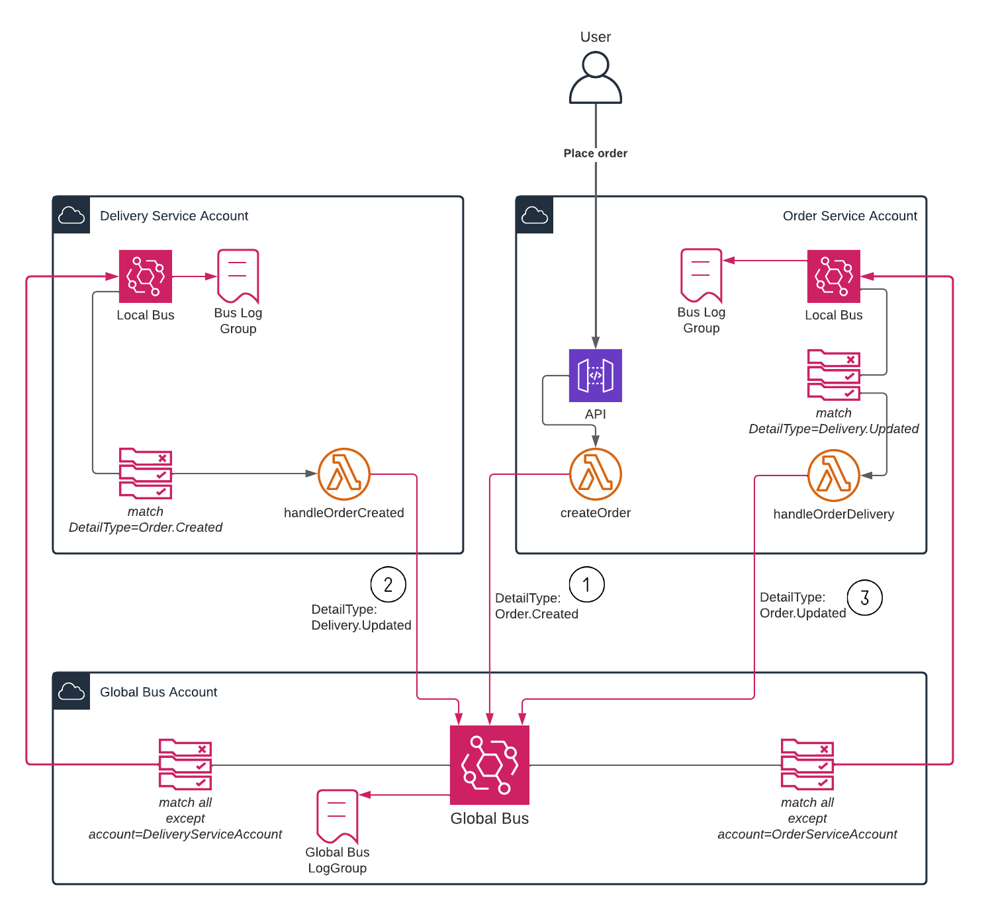

# Cross-account / cross-domain EventBridge example

This is a demonstration of using EventBridge across accounts to publish cross-domain application events. It uses the example of a simple e-commerce application: 
* A customer creates an order which is handled by an order service in its own account.
* Delivery of orders is handled by a separate service in a different account. 

This example uses AWS CDK to create all resources and [CDK Pipelines](https://docs.aws.amazon.com/cdk/v2/guide/cdk_pipeline.html) to deploy everything.

To use this example, three accounts are required:

1. A bus account for the global EventBridge bus
2. An order service account
3. A delivery service account

Cross-domain events are achieved using EventBridge in the following way.
1. Applications publish events to the global EventBridge bus (cross-account).
2. The global bus forwards events to every application account's local custom EventBridge bus (except the event sender's account)
3. If application wish to respond to an event, they create a rule in their local bus.

For event observability, each bus also forwards all events to a CloudWatch log group in the same account.



The flow of events for the simple order creation use case is as follows.

1. An HTTP POST API is used to create an order. The backing Lambda function generates an order ID and sends an `Order.Created` event to the global bus
2. The delivery service picks up the `Order.Created` event from its local bus, processes the order (since this is an example, we just use a five-second sleep!), and sends a `Delivery.Updated` event including all the important delivery details to the global bus.
3. The order service picks up the `Delivery.Updated` event from its local bus, and finally sends an `Order.Updated` event to the global bus.

The code is commented to help explain the resources used and flow of events.

| CDK Stack | Lambda functions |
|----------|----------------|
| [bus-stack.ts](./stacks/bus-stack.ts) | _N/A_ |
| [order-stack.ts](./stacks/order-stack.ts) | [order-handler.ts](./src/order-handler.ts) |
| [delivery-stack.ts](./stacks/delivery-stack.ts) | [delivery-handler.ts](./src/delivery-handler.ts) |

## Setup
1. Install the CDK and application modules:
```
npm install -g aws-cdk
npm install
```

2. Set some environment variables for the three accounts.
```
export BUS_ACCOUNT=<your-account-id>
export ORDER_SERVICE_ACCOUNT=<your-account-id>
export DELIVERY_SERVICE_ACCOUNT=<your-account-id>
```

3. CDK Bootstrap each account. The following commands uses AWS profiles to indicate the account. There are [other ways](https://docs.aws.amazon.com/cdk/v2/guide/bootstrapping.html) if you are not using profiles.

```
cdk bootstrap --profile busAccount.AdministratorAccess
cdk bootstrap --profile orderServiceAccount.AdministratorAccess
cdk bootstrap --profile deliveryServiceAccount.AdministratorAccess
```

## Deployment
Deploy each stack:
```
cdk deploy \
 -c order-service-account=${ORDER_SERVICE_ACCOUNT} \
 -c bus-account=${BUS_ACCOUNT} \
 -c delivery-service-account=${DELIVERY_SERVICE_ACCOUNT} \
 --profile busAccount.AdministratorAccess \
 BusStack

cdk deploy \
 -c order-service-account=${ORDER_SERVICE_ACCOUNT} \
 -c delivery-service-account=${DELIVERY_SERVICE_ACCOUNT} \
 -c bus-account=${BUS_ACCOUNT} \
 --profile deliveryServiceAccount.AdministratorAccess \
 DeliveryServiceStack

cdk deploy \
 -c order-service-account=${ORDER_SERVICE_ACCOUNT} \
 -c bus-account=${BUS_ACCOUNT} \
 -c delivery-service-account=${DELIVERY_SERVICE_ACCOUNT} \
 --profile orderServiceAccount.AdministratorAccess \
 OrderServiceStack
```

## Usage
Create a test order:
```
curl -X POST https://<API_GATEWAY_REST_API>.execute-api.eu-west-1.amazonaws.com/prod
```
Replace `<API_GATEWAY_REST_API>` with the ID of the OrderService API. This is output when you deploy `OrderServiceStack`

Verify that all events have been sent by checking the latest entries in the Global Bus logs in the bus account. You should see the three events as shown in this screenshot:


