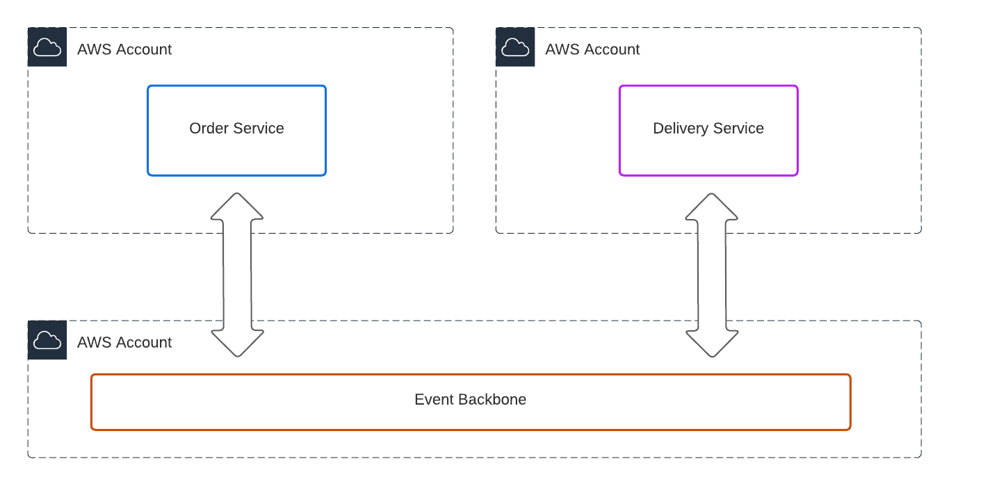
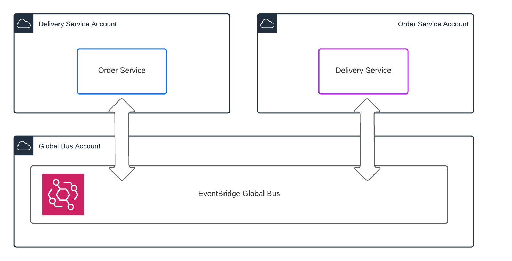
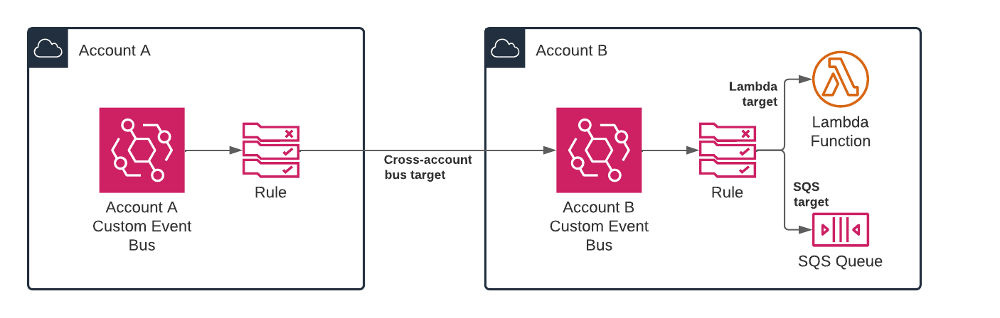

# How to use EventBridge as a Cross-Account Event Backbone
<!--
---
// Front matter for dev.to
title: EventBridge as a Cross-Account Event Backbone
published: false
description: Achieving event driven architecture across applications, services and accounts in AWS
tags: aws, eventbridge, crossaccount, kafka
//cover_image: https://direct_url_to_image.jpg
---
-->

Two of the emerging best practices in modern AWS applications are:
1. Use a separate AWS account per application
2. Decouple communication between systems using events instead of point-to-point, synchronous communication.

This post will show how EventBridge can provide an ideal event backbone for applications in multiple AWS accounts, achieving both of these best practices with minimal complexity. To illustrate these concepts, we will use the example of an eCommerce application. We will simplify it and imagine two separate services, each running in a separate AWS account. Simple applications do not need to have all components separated in their own accounts like this, but as the product grows and each service becomes sufficiently complex, with different teams involved, it becomes necessary to use dedicated accounts.

Our eCommerce application has two services - the Order Service and the Delivery Service. There is a logical link between orders and the delivery of products being fulfilled, but these are regarded as separate services that should not be tightly coupled.

In this multi-account setup, we will also dedicate an account for the event backbone itself. This gives us three accounts, with the potential to add more as we grow the number of services or applications.



Before we dive into the solution, let's talk about why account separation and event-driven communication are regarded as best practices. We want to avoid the mistake of accepting 'best practices' without understanding the reasoning!

## Separate AWS accounts

An AWS account is the ultimate boundary for permissions and quotas. IAM is used for fine-grained access control and is one of the most impressive and fundamental AWS services there is. There is no escaping the fact that enforcement of [the principle of least privilege](https://docs.aws.amazon.com/IAM/latest/UserGuide/best-practices.html#grant-least-privilege) takes a lot of time and a solid understanding. If you mix applications, environments or teams in a single AWS account, you rely on permissions boundaries, complex IAM policies and strict policy change processes to avoid impacting others' resources. This will result in a significant overhead in engineering time as well as the risk of human error. By providing each application and environment with a separate account, you can rely more on the account boundary to protect against the workloads and actions of others. You can still enforce minimal privilege but in a much more agile way, by detecting and continually improving policies instead of strict enforcement up front. For development accounts, this is a big productivity boost.

AWS quotas put limits on the number of requests you can make or resources you can utilise by default in an account. You have a mix of soft quotas, which can be raised if you ask, and hard quotas, which, more often than not, cannot budge. There may be some exceptions here if you have specific needs and engage directly with your AWS account manager. Once you mix workloads in an AWS account, those workloads share quotas. This can have the effect of limiting the scalability of each application or the more drastic result where one application can deny the other from operating because it is simply reaching a quota. Take AWS Lambda as an example. If your region has a default quota of 1,000 concurrent executions and one application reaches this, it will throttle any other workload from using Lambda. Using separate accounts removes the risk of this cross-application side-effect.

The drawback of using separate accounts for everything will come with the account management overhead. If you end up with more than a handful of accounts (100's or 1000's of accounts is not uncommon!), account automation is a must. I recommend a solution based on [org-formation](https://github.com/org-formation/org-formation-cli) for this.

## Event based communication

The case for event-based communication is less clear cut  and more a case of nuanced trade-offs. With synchronous communication, an application will send a request to a known address and wait to receive a response. The advantage as a developer or architect is that you know what service you are addressing and you can follow the flow of logic and data clearly. There are many disadvantages, however. 

Synchronous communication means you have to know the address of the application or service that is processing your request. This is called _location coupling_, and it means you have to have a mechanism to update the address in all clients if it changes. Service discovery solutions are used to solve this but not without their own complexity. With synchronous communication, you also get _temporal coupling_, since the action of making a request is bound in time to the processing of that request. Temporal coupling has a greater impact, since it results in failures when the request processor is not online, not reachable, or just busy with other requests. Temporal coupling means that the receiver must scale exactly in line with the request volume.

Asynchronous (event-driven) communication can remove these forms of coupling. Instead of sending events or requests to a known receiver, you send events to a bus, queue or topic. The receiver can scale independently and even delay processing. Message durability provided by the bus or queue can ensure that events don't get lost or undelivered, even if the event processor is temporarily offline.

That said, asynchronous communication is harder to reason about. It becomes more difficult to follow the flow of data and logic. I would say it requires a mindset change for engineers and also means you need better observability tooling to capture event flows.

While event-driven seems to be the more architecturally sound approach, there is still a case for going synchronous. We have all become used to integrating SaaS platforms using APIs and webhooks. This is essentially all synchronous communication. It has become a de-facto standard for SaaS product integration because it is easy for the consumer to understand, get started and troubleshoot. It shifts the burden to the SaaS provider who now has to ensure the API is always available, robust and scalable.

Even though I'm a big fan of event-driven, I still think there's a valid case for good, well-documented, synchronous APIs where simplicity and clarity are more important than decoupled perfection. A well-balanced enterprise architecture might combine a small number of REST APIs at high-level boundaries across distinct applications with asynchronous messages for callbacks and updates as well as lower-level, inter-service communication.

We have covered the reasons for these two underlying best practices. Let's now dive in to our cross-account event driven solution using EventBridge!

## What is an Event Backbone?

An Event Backbone is simply an event communication mechanism that serves multiple applications. The concept evolved from the idea of an Enterprise Service Bus (ESB) in the time of service-oriented architecture (SOA). ESBs have a broader set of capabilities however, including more complex routing, extensive transformation capabilities and even business rule execution. An event backbone is fundamentally simpler, focusing on scalable, reliable event transport and ensuring that business logic belongs to the services and not the bus.

The term is [commonly used](https://kgb1001001.github.io/cloudadoptionpatterns/Event-Based-Architecture/Event-Backbone/) for such systems based on Apache Kafka, since Kafka was one of the first technologies that enabled event backbones for microservice communication with massive scale and performance. Since Kafka was first released over a decade ago, cloud managed services have evolved to the degree where you don't need to Kafka to have a scalable, reliable event backbone. Amazon EventBridge is the most obvious example, since it has managed to pull off the amazing feat of having a large feature set and massive scalability while remaining one of the simplest cloud services there is.

If you are a Kafka fan, there is effort being put in by AWS in reducing the complexity with the managed MSK, including the MSK Serverless version. I would compare MSK to EventBridge in the same way I would compare EKS to Fargate or Lambda. You get a lot more control and configurability but even with the AWS managed service, you still have plenty of complexity.



The beauty of something like EventBridge is that the investment is so low. If your needs evolve, you can adapt and use alternative options for specific cases. You are not stuck with it because of a large investment in infrastructure or training. If you need durability, add SQS! If you need lower latency, ordered streams, you can add Kinesis! It's possible to build a event backbone on Kinesis or SNS/SQS but EventBridge is still the best place to start, integrates with more services and has really good cross-account support.

## Cross-account EventBridge

We already mentioned that EventBridge has good support for cross-account scenarios. With EventBridge, you can create a Rule with any other EventBridge _bus_ as a target. This bus can be in a different account.



For this to work, the target bus should have a policy that allows the source account to send events to it.

Now, let's imagine this idea at a larger scale, where we have multiple accounts, each with their own applications or services. Where does each application need to send events? There are a few options here. If you want to explore all the options, take a look at [this great talk from re:Invent 2020 on Building event-driven architectures](https://youtu.be/Wk0FoXTUEjo).  In this article, I'll focus on my preferred option, referred to in that video as the "single-bus*, multi account-pattern". There are are in fact multiple buses, but a central bus in a dedicated account is used to route messages to multiple accounts, each with their own local bus.

The important characteristics of this architecture are:
- Every service send events to a global bus, a dedicated bus in a separate account
- Every service receives events from a local bus in its own account
- The global bus has rules to route all events to every local bus except the local bus of the event sender. This could be classified as a _fan-out pattern_.

*Note:* Every account comes with a `default` EventBridge bus, so it's not mandatory to create custom buses. We do so so we can control permissions at a bus level, and to separate these custom events completely from the AWS service events that are sent to the default bus.

## Why do we need a global bus _and_ local buses?

You might ask why services can't send events to their local bus instead of the global bus. Since each service receives events from their local bus, should it not publish there too? Apart from adding an additional layer, it's simply not possible with EventBridge.  You cannot have events transitively routed to a third bus (`local -> global -> local`). Only one cross-account target is allowed in the chain (`global -> local`). This is covered in the [EventBridge documentation](https://docs.aws.amazon.com/eventbridge/latest/userguide/eb-cross-account.html):

> “If a receiver account sets up a rule that sends events received from a sender account on to a third account, these events are not sent to the third account.”

You might also wonder why we can't get rid of the local buses altogether and just have the global bus, letting all services send and receive events to and from it. There are two main reasons against this approach. To receive messages from a bus in another account, you would have to create rules in another account's bus for every pattern you want to match. This is not a clean separation of concerns. Secondly, even if you did create rules in the global bus, you cannot invoke any cross-account target with an EventBridge rule, say, a Lambda function, you can only target another EventBridge bus in another account.

## Cross-account EventBridge backbone example

Let's return to our eCommerce use case. Our application has two services - the Order Service and the Delivery Service. In a real world scenario, these systems have sufficient features and logic, so it's warranted to separate them in different account. There is a logical link between orders and the delivery of products being fulfilled, but these are regarded as separate services that should not be tightly coupled.

- When orders are created, we want the delivery service to be notified.
- When deliveries are sent, we want to update orders accordingly.


We have two services and three accounts:
1. The Order Service account, which has the order service logic and its own "local" EventBridge bus
2. The Delivery Service account, which has the delivery service logic and also has its own "local" EventBridge bus
3. The Global Bus account, which only has a "global" EventBridge bus. This is used to route messages to other accounts.

The flow of events for the order creation use case is as follows.

1. An HTTP POST API is used to create an order. The backing Lambda function generates an order ID and sends an `Order.Created` event to the global bus.
2. The delivery service picks up the `Order.Created` event from its local bus, processes the order , and sends a `Delivery.Updated` event including all the important delivery details to the global bus.
3. The order service picks up the `Delivery.Updated` event from its local bus, and finally sends an `Order.Updated` event to the global bus.


> **Example Source**
>  The full source code with documentation for this is available on [github.com/fourTheorem/cross-account-eventbridge](https://github.com/fourTheorem/cross-account-eventbridge/). It include a CDK pipeline for deployment of all resource to the three accounts.

## Global bus event rules

Events cannot be sent anywhere in EventBridge without a rule. Rules can be based on a schedule or an event pattern. For our backbone, we need to create pattern-based routing rules in the global bus. We create a single rule for each service account:

```yaml
eventPattern:
  account:
    - 'anything-but': 12345789012  # Anything but the source account
```

This rule will route all events to every service account except the one that sent the message.

## Logging events for debugging and auditing

One of the challenges people encounter with EventBridge when using it for the first time relates to observability. It can be difficult to understand which events are flowing through a bus and see their contents so that you can troubleshoot delivery failures. A simple way to address this is to create a rule to capture and log all events to CloudWatch Logs. How do you capture all events? EventBridge rules require you to have at least one condition in your filter, but a prefix match expression with an empty string will capture all events from any source:

```yaml
eventPattern:
  source:
    - prefix: ''
```

## Event structure, schemas and validation

_Parts of this section were taken from [What can you do with EventBridge? (fourTheorem blog)](https://www.fourtheorem.com/blog/what-can-you-do-with-eventbridge)._

With EventBridge, you have no obligation to provide a schema for your events but there is support if you wish to do so. Without a schema, you can be flexible in how you evolve the event structure but it can also lead to confusion for other developers who are trying to consume your events or even publish them in a way that is consistent with the organisation. This is even more important when we are talking about an event backbone, since you can assume that producers and consumers are in different teams or departments.

Start with a clear set of principles for the structure of these events and how to manage changes in event structure over time. With EventBridge, each event can contain the following properties:

|**Property** |**Purpose** |
|--- |---- |
|_Source_ |This defines the message origin. For AWS services, this might be something like `aws.config` but for your custom events you could specify the application or service name, like `order.service`.|
|_DetailType_ |This usually denotes the event type, for example, `Order.Created` |
|_EventBusName_ |The name of your custom bus or default. |
|_Detail_ |This is the JSON-encoded payload of the message and it can contain relevant details about your event (e.g. order ID, customer name, product name, etc.)|

The event structure can represent a contract between the producer and the consumer. Once a consumer strictly relies on fields being available in the `Detail` payload, you have semantic coupling between producer and consumer. There is a balance to be struck between including as much detail as possible in the message and reducing this semantic coupling. Too little data means that consumers will likely have to go and fetch extra data from the originating system.

Too much data for your events means consumers come to rely on all that data in a certain structure, semantically coupling it to the producer and making it hard to change the structure later. A reasonable approach here is to start with less data and add properties incrementally as the need arises.

Some basic principles for event structure include:

- Do not rely on the `Source` for pattern matching as a consumer. A consumer should not need to be concerned with where the event came from.
- Enforce a consistent structure for `DetailType`.
- Separate the `Detail` into two child properties, `metadata` and `data`. This allows you to add additional metadata without mixing it in with the event payload itself. 

While it is optional to _enforce_ schema validation, it is worthwhile if you are serious about EventBridge adoption at scale. EventBridge allows you to publish schemas in a registry for other teams and developers. This feature supports typed code binding generation too. If you do not want to create and upload the schema, you have the option to let EventBridge discover the schemas for you from events passing through the bus.

If stricter schema enforcement is something you want to do, I'd recommend looking at the approach taken by PostNL as described by [Luc van Donkersgoed](https://twitter.com/donkersgood/) in [this insightful talk](https://www.youtube.com/watch?v=nyoMF1AEI7g).

For great ideas on structuring event payloads, take a read of [Sheen Brisals' post on the Lego Engineering blog](https://medium.com/lego-engineering/the-power-of-amazon-eventbridge-is-in-its-detail-92c07ddcaa40).

## Further reading and viewing

We have covered the fundamental building blocks for a cross-account backbone with EventBridge. There is plenty more you can do with EventBridge, like using archives and event replaying, as well as integrating it into other AWS services. For a small amount of upfront effort and minimal ongoing maintenance, you can achieve a very flexible and scalable event bus for many applications across accounts.

If you want to read more on EventBridge, [Luciano Mammino](https://twitter.com/loige) and I have written an article and have a YouTube video and podcast episode to accompany it:
1. [What can you do with EventBridge? (fourtheorem.com blog)](https://www.fourtheorem.com/blog/what-can-you-do-with-eventbridge)
2. [What do you need to know about SNS? (fourtheorem.com blog)](https://www.fourtheorem.com/blog/what-do-you-need-to-know-about-sns]) - includes a comparison of SNS and EventBridge
3. [AWS Bites Episode 23: What’s the big deal with EventBridge? - YouTube](https://youtu.be/UjIE5qp-v8w)

We also have a full series of podcast episodes covering all the main AWS event services, including a deep dive on Kafka, so check out the playlist [here](https://www.youtube.com/watch?v=CG7uhkKftoY&list=PLAWXFhe0N1vLHkGO1ZIWW_SZpturHBiE_).

---

About the author:....